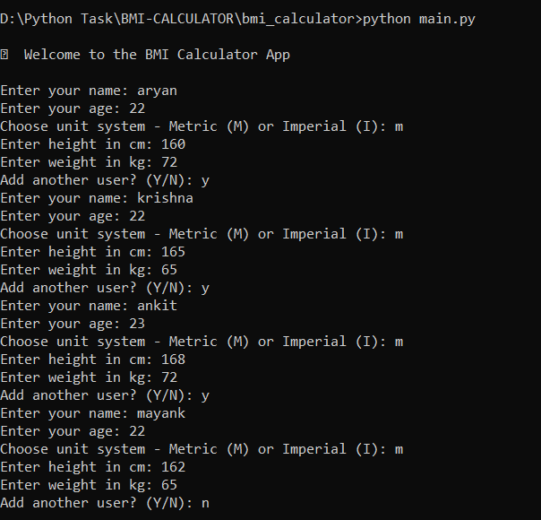
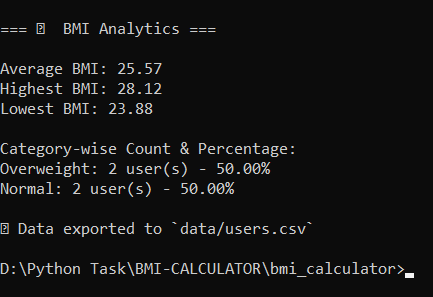
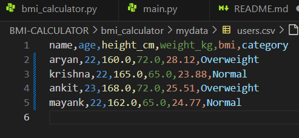

# BMI-CALCULATOR
This is a BMI Calculator.

# Setup Instruction 

## 1. Clone the repository in your local system
``bash
git clone https://github.com/aryand2002/BMI-CALCULATOR.git
cd BMI-CALCULATOR

## 2. Run the application 
``bash
cd bmi-calculator 
python main.py

## 3. 💾 Exported Data
After you enter user data, the program will automatically save the results (BMI, category, etc.) to a CSV file inside the mydata/ folder.
You can open the .csv file 
1. using Excel 
2. Google Sheets
3. any text editor.

# screenshots

## 1. Running the Program

## 2. analytics

## 3. CSV FILE OUTPUT
 

